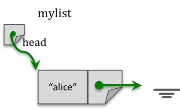

Review Part 2
========================

Learning Objectives
-------------------
- Node elements
- Linked List

<hr>

<br>

*Discuss your answers in the discussion forum titled "Questions on Modules".*

<br>


Problem 1
---------
**Given the test class `TestLinkedList` and the `SimpleList` constructor. Create a
class called `ListNode`.**


```java
import java.awt.Point;

public class TestLinkedList 
{
    public static void main(String[] args) 
    {
        SimpleList myList;
        myList = new SimpleList();
        myList.addAtEnd(new Point (3,4));
        myList.addAtEnd(new Point (5,6));
        myList.addAtFront(new Point (1,2));
        System.out.println(myList);
    }
}

public class SimpleList
{ 
    private ListNode first;

    public SimpleList ()
    {
        first= null;
    }

    public void insertAtBeginning(Object d)
    { 
        ListNode temp;
        temp = new ListNode(d, first);
        first = temp;
    }
    // other methods…
}
```


<br><br><br>


Problem 2
---------
**Given the previous test class, `SimpleList` and `ListNode`.
Write a method in `SimpleList` that checks whether the list contains a data value at a
specified index. If the value is found returns `true`, otherwise returns `false`.**

```java
public boolean contains(Object d, int index)
{
    // TO COMPLETE
}
```


<br><br><br>


Problem 3
---------
**Given the class `Friend` and the class `LList` class composed of `Node` objects:**

```java
public class Friend 
{
    private String name;
    private String phoneNumber;
    public Friend(String name)
    {
        this.name = name;
        this.phoneNumber = "unknown";
    }

    public Friend(String name, String number)
    {
        this.name = name;
        this.phoneNumber = number;
    }

    public String toString()
    { return this.name + " " + this.phoneNumber; }
}

public class Node 
{
    private Friend data;
    private Node next;

    public Node(Friend c) 
    {
        data = c;
        next = null;
    }

    /* Additional accessor methods for attributes */
    public void setNext(Node n)
    { this.next = n; }

    public Node getNext()
    { return next; }

    public Friend getData()
    { return data; }

    public String toString()
    {    return data.toString(); }
}


public class LList
{
    private Node head;

    public LList ()
    { this.head = null; }

    public void addSomewhere(Node elem) 
    {
        if (this.head == null) 
        {
            head = elem;
            return;
        }

        Node walker = head;
        for (int pos=0; pos < 2; pos++)
        {
            if (walker.getNext() != null)
            {
                walker = walker.getNext();
            }
            pos++;
        }
        elem.setNext(walker.getNext());
        walker.setNext(elem);
    }
    
    public void printElements()
    {        
        Node walker = head;
        
        while(walker != null)
        {
            System.out.println(walker.toString() + ", ");
            
            walker = walker.getNext();
        }                
    }
}
```

**and the method main():**

```java
public static void main(String[] args)
{
    Friend c1 = new Friend("dan");
    Friend c2 = new Friend("sam", "650-111-1010");
    Friend c3 = new Friend("moe", "650-222-2020");
    Friend c4 = new Friend("kim", "650-333-3030");
    Friend c5 = new Friend("ann");
    
    // create an empty list
    LList mylist = new LList();
    
    // add customers
    mylist.addSomewhere(new Node(c1));
    mylist.addSomewhere(new Node(c2));
    System.out.println("\nPart a) list after adding two:");
    mylist.printElements();
    
    mylist.addSomewhere(new Node(c3));
    System.out.println("\nPart b) list after adding three:");
    mylist.printElements();
    
    mylist.addSomewhere(new Node(c5));
    System.out.println("\nPart c) list after adding four:");
    mylist.printElements();
}
```

For parts a, b, & c provide:

drawing: **A drawing representing the list after all statements have completed for specific part.** <br>
Note: Include a representation for start and end of list, and data portion of each node.

output: **The text output after all statements have completed for specific part.** <br>
Note: You do not need to define any print or toString methods. Just write the outputs.
For the output of an element, refer to Customer.
For the output of the list, following the method you defined in part a.

<br><br>

For example:

<p>drawing:
        </p>
       
<br> 
output:
<pre><code>Part z) list after
alice 650-123-4567 ->
null</code>
</pre>

<br>

part a.

<br>

part b.

<br>

part c.


<br><br>


