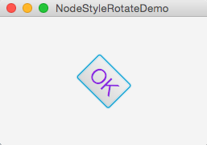
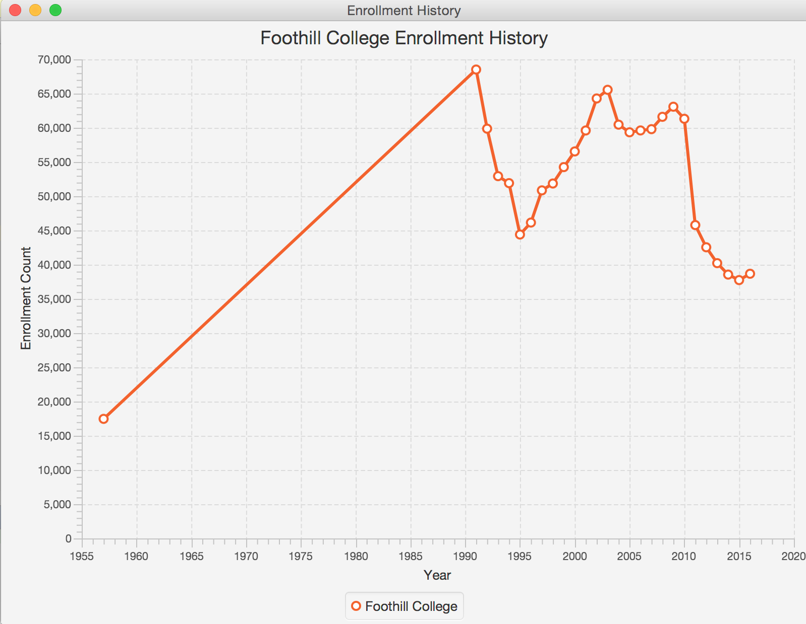

Practice Problems
========================

Learning Objectives
-------------------
- Working with JavaFx Application
- Modifying properties of a node
- Creating a line chart

<br><br>

Problem 1
---------
**In the example below, what happens when we set d1? what about d2?**
```java
        // assume somewhere in main
        DoubleProperty d1 = new SimpleDoubleProperty(1);
        DoubleProperty d2 = new SimpleDoubleProperty(2);
        d1.bind(d2);
        System.out.println("d1 is " + d1.getValue() + " and d2 is " + d2.getValue());

        // QUESTION: What happens when we set the value of d1?
        d1.setValue(50.1);
        System.out.println("d1 is " + d1.getValue() + " and d2 is " + d2.getValue());


        // QUESTION: What happens when we set the value of d2?
        d2.setValue(70.2);
        System.out.println("d1 is " + d1.getValue() + " and d2 is " + d2.getValue());
```

<br><br>

Problem 2
---------
**Modify NodeStyleRotateDemo class to rotate the button instead of the pane.**

Modify the properties of the button by:
-rotating the button by 45 degrees and
- setting the color to one of your choice
- increasing the font size

```java
@Override 
public void start(Stage primaryStage)
{
    // Create a scene and place a button in the scene
    StackPane pane = new StackPane();
    Button btOK = new Button("OK");
    pane.getChildren().add(btOK);

    pane.setRotate(45);
    pane.setStyle("-fx-border-color: red; -fx-background-color: lightgray;");

    Scene scene = new Scene(pane, 200, 250);
    primaryStage.setTitle("NodeStyleRotateDemo");
    primaryStage.setScene(scene);
    primaryStage.show(); 
}
```

*Note: Refer to NodeStyleRotateDemo class.*

<p>   </p>

<br><br>


Problem 3
---------
**Complete ChartEnrollmentHistory class to display historical data from Foothill College as follows:**
- Create a new object of type LineChart with a Number x-axis and y-axis
- Set the title of the series to be descriptive based on the data (see FoothillCollege class)
- Define an XYChart.Series
- Populate the series with data from the FoothillCollege instance fc
- add the series to the LineChart object
- add the LineChart object to the Scene graph

*Note: Refer to FoothillCollege class and ChartEnrollmentHistory class.*

<p>   </p>
<br><br>