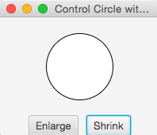
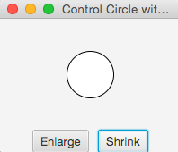
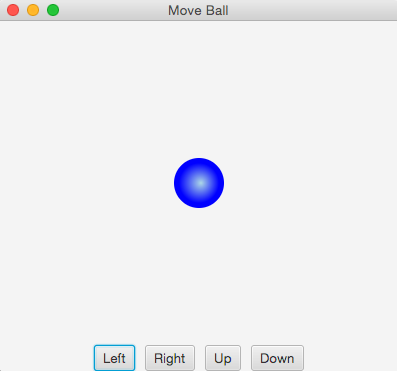
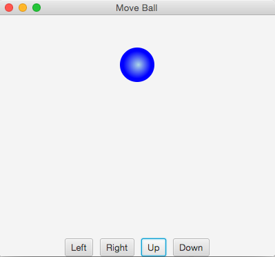

Practice Problems
========================

Learning Objectives∂
-------------------
- Working with `EventHandler`
- Anonymous classes
- Lambda Expressions

<br><br>

Problem 1
---------
**Modify `ControlCircle` to handle the Shrink button such that the circle will 
get smaller when the button is clicked.**


 <div style="font-size: 24px;">

&nbsp; &nbsp;->&nbsp;&nbsp; 

</div>

<br><br>

Problem 2
---------
**Modify `ControlCircle` and rename to `ControlCircle02` to use an anonymous classes to handle events.**

<br><br>

Problem 3
---------
**Modify `ControlCircle` and rename to `ControlCircle03`  to use lambda expressions to handle events.**


<br><br>

Problem 4
---------
**What is the output of the following code?**

```java
public class TestSetAction {

    public static void main(String[] args) {
        TestSetAction myTest = new TestSetAction();
        myTest.setAction1(() -> System.out.print("Action 1! "));
        myTest.setAction2(e -> System.out.print(e + " "));
        System.out.println(myTest.setAction3(e -> e * 2));
    }

    public void setAction1(T1 t)
    {    t.m(); }

    public void setAction2(T2 t)
    {    t.m(4.5); }

    public double setAction3(T3 t)
    {    return t.m(5.5); }
}

interface T1
{    public void m(); }

interface T2
{    public void m(Double d); }

interface T3
{    public double m(Double d); }
```

<br><br>

Problem 5
---------
**Write a program that moves the ball in a pane. Start with class `BallPane` and 
provide the buttons and handlers for moving the ball left, right, up, and down. Then add handlers in class `MoveBall`**


<div style="font-size: 24px;">

&nbsp; &nbsp;->&nbsp;&nbsp; 

</div>

<br><br>
